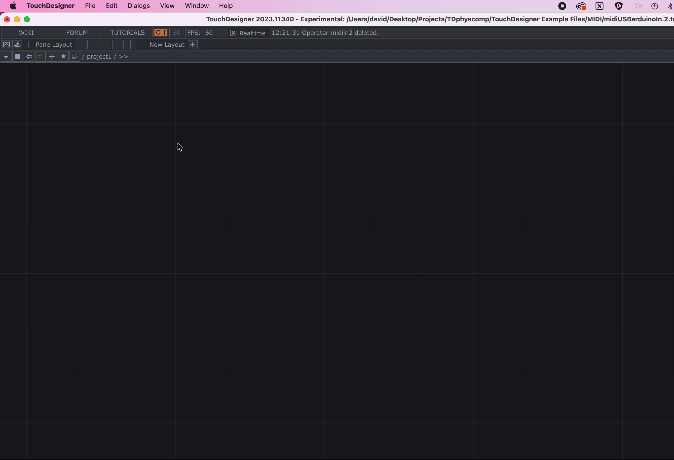
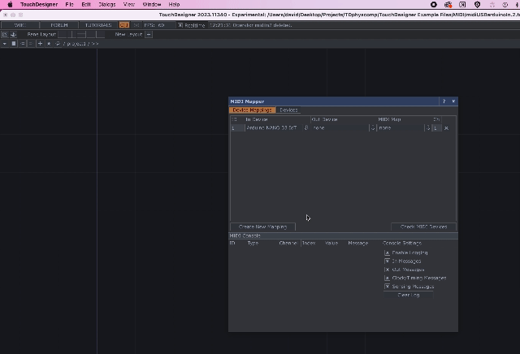

# MIDIUSB with Arduino

## Sections
[Description](#description)  
[Materials and Libraries](#materials-and-libraries)  
[Arduino Circuit](#arduino-circuit)
[Arduino Code](#arduino-code)
[TouchDesigner Setup](#touchdesigner-setup)
[TouchDesigner Network](#touchdesigner-network)
[Related Resources](#related-resources)


## Description

In this example we will make our own MIDI controller to control visuals in TouchDesigner. This example uses an Arduino microcontroller with digital and analog sensors (buttons and potentiometer) as well as the Arduino MIDIUSB library and its example code, to send note on, note off, and control change messages. 

## Materials and Libraries

* [Arduino Nano 33 IoT](https://store-usa.arduino.cc/products/arduino-nano-33-iot) (or other Wifi Enabled board, MKR 1010, etc)
* [Arduino IDE](https://www.arduino.cc/en/software)
* [TouchDesigner (free version)](https://derivative.ca/)
* Breadboard, USB cable, Jumper wires
* [Arduino MIDIUSB Library](https://www.arduino.cc/reference/en/libraries/midiusb/)  
* [Arduino MIDIUSB Write Example](https://github.com/arduino-libraries/MIDIUSB/blob/master/examples/MIDIUSB_write/MIDIUSB_write.ino)


## Arduino Circuit:
For this example I'm using a circut with 3 buttons (digital inputs).


## Arduino Code:

### Dependencies:

Start the sketch by including the [MIDIUSB Library](https://www.arduino.cc/reference/en/libraries/midiusb/).  From the menu go to "Sketch" -> "Include Library" -> "MIDIUSB"


Next open the [MIDIUSB Write Example](https://github.com/arduino-libraries/MIDIUSB/blob/master/examples/MIDIUSB_write/MIDIUSB_write.ino).

From the menu go to "File" -> "Examples" -> "MIDIUSB" -> "MIDIUSB_write"


Copy the following functions into your sketch.  These functions will allow you to write `note on`, `note off` and `control change` messages without having to look up and write out the hexidecimal values of each program and channel. Instead you can now use this functions and pass your MIDI arguments (channel, pitch, velocity, CC number, controller value) as decimal bytes ranging from 0 - 127.  Also note that this library zero indexes the channel numbers.  Many DAWs and MIDI devices will allow you to send messages over 1 of 16 channels ranging from 1-16, however arduino values will be shifted to a range of 0-15.
    
    void noteOn(byte channel, byte pitch, byte velocity) {
        midiEventPacket_t noteOn = { 0x09, 0x90 | channel, pitch, velocity };
        MidiUSB.sendMIDI(noteOn);
    }

    void noteOff(byte channel, byte pitch, byte velocity) {
        midiEventPacket_t noteOff = { 0x08, 0x80 | channel, pitch, velocity };
        MidiUSB.sendMIDI(noteOff);
    }

    void controlChange(byte channel, byte control, byte value) {
        midiEventPacket_t event = { 0x0B, 0xB0 | channel, control, value };
        MidiUSB.sendMIDI(event);
    }
### State Change:

Next declare some variables to track each button's state change. 

    int pButton1;
    int pButton2;
    int pButton3;

Next inside of your ```setup()``` make sure you use ```Serial.begin()```.  Remember the baudrate, this will be used later in your touchdesigner network.  I'll use 9600.  Set the registers of your connected pins as `INPUT_PULLUP`, this activates the internal pull up resistors allowing for a circuit with no external resistors on the breadboard.  
    
    void setup(){
        Serial.begin(9600);
        pinMode(2, INPUT_PULLUP);
        pinMode(3, INPUT_PULLUP);
        pinMode(4, INPUT_PULLUP);
        pButton1 = digitalRead(2);
        pButton2 = digitalRead(3);
        pButton3 = digitalRead(4);
    }

Next inside of your ```loop()``` store button readings for each button in a variable.  

    int button1 = digitalRead(2);
    int button2 = digitalRead(3);
    int button3 = digitalRead(4);

Then for each button, detect a state change, comparing current state to previous state.  When a change is detected send a `note on` if the button is pressed, send a `note off` when the button is released.

Since we are wired using the Arduino's internal pullup-resistors a reading of 1 means the button is not pressed, a reading of 0 means the button is pressed down. 

Make sure you update your previous button variables (`pButton`) to reflect the detected changes.

  if (pButton1 != button1) {

    if (button1 == 0) {
      noteOn(0, 48, 100);
      MidiUSB.flush();
    }
 
    if (button1 == 1) {
      // turn off that note if you let go of the button
      noteOff(0, 48, 100);
      MidiUSB.flush();
    }

    // update button status to avoide continuously sending MIDI notes
    pButton1 = button1;
  }

Use the above strategy for each button.

[See full example code here](https://github.com/RiosITP/TDphyscomp/blob/main/Arduino%20Files/MIDI/sendNotesMIDIUSB/sendNotesMIDIUSB.ino)

Verfiy your code is working and uploaded before moving on to the next step.

## TouchDesigner Setup

For the next step make sure your Arduino is already plugged into your computer and running the code from above.

### MIDI Device Mapper Dialog
Go TouchDesigner's menu and find the MIDI Device Mapper under "Dialogs" -> "MIDI Device Mapper"

When the dialog opens select the Arduino Nano 33 IOT as an `In Device`




If you interact with your buttons you should see the MIDI Messages appear in the MIDI Console section of the dialog.  If you are seeing MIDI messages, you are now ready to parse those messages in TD.  



## TouchDesigner Network
### Selecting Messages and Notes

Once you confirm that TD is receiving MIDI messagaes, close the MIDI Device Mapper. In your network use a `midiIn` CHOP to access incoming MIDI messages.  The `midiIn` CHOP may be blank when you first create it but it should update as you send messages.


Next try using the incoming information.  This example will use each of the three buttons to control the alpha of an red, green, and blue `constant` TOP, respectively.

Make the `constant` tops and chose whatever colors you like.

Connect your `midiIn` CHOP to a `null` CHOP.  Then export each channel to the alpha parameter of a constant: `chan1` to the alpha parameter of `constant1`,`chan2` to the alpha parameter of `constant2`, `chan3` to the alpha parameter of `constant3`.

Add a `composite` TOP and feed all three `constant` TOPs into the `composite` to see how the colors blend together.  In the `constant` TOP use


## Add a Potentiometer


Add a potentiometer to the circuit. Connect pin 1 to GND rail, pin 2 to Analog Pin 0 (A0), pin 3 to the 3.3 volt rail.


### Average the Sensor Values
  The sensor may not output the exact same values consistently.  If your sensor is noisy, one way to smooth the values is by averaging them.

  Take a small sampling of values and add them up, then divide by the number of samples you took.  Declare global variables for your potentiometer's average ` int potentiometerAverage;` and for the amount of samples you want to use when calculating the average:


    int potentiometerAverage;
    int avgSamples = 25; // try different numbers

  In the loop, declare a variable for the sum of your averaging method . The

    void loop() {

        int total = 0;

        for (int i = 0; i < avgSamples; i++) {
            total += analogRead(A0);
        }

        potentiometerAverage = total / avgSamples;

        Serial.println(potentiometerAverage);
    }


## Analog State Change with Noise Reduction

Similar to our [Button State Change](#button-state-change).  There will be times when you want a sensor to trigger something only when the sensor has changed significantly.  D

    int noise = 3;
    int prevPot;

    void setup() {
        Serial.begin(9600);
        prevPot = analogRead(A0);
    }

    void loop() {
        // reset total each loop
        int pot = analogRead(A0);

        if (abs(prevPot - pot) > noise) {
            Serial.println(pot);
            prevPot = pot;
        }
    }


### Analog State Change
### Send Control Change

## Use CC to control a graphic in TD


## Related Resources
* [Matthew Ragan MIDI Tutorials](https://www.youtube.com/watch?v=XLeghJmFBh0&ab_channel=MatthewRagan)
* [MIDI Notes Chart](https://newt.phys.unsw.edu.au/jw/notes.html)
* [MIDI CC Number Chart](https://anotherproducer.com/online-tools-for-musicians/midi-cc-list/)
* [MIDI Monitor Software](https://www.snoize.com/MIDIMonitor/)
* [MIDI Monitor Browser App](https://www.midimonitor.com/)
* [ITP Physical Computing Site](https://itp.nyu.edu/physcomp/)

