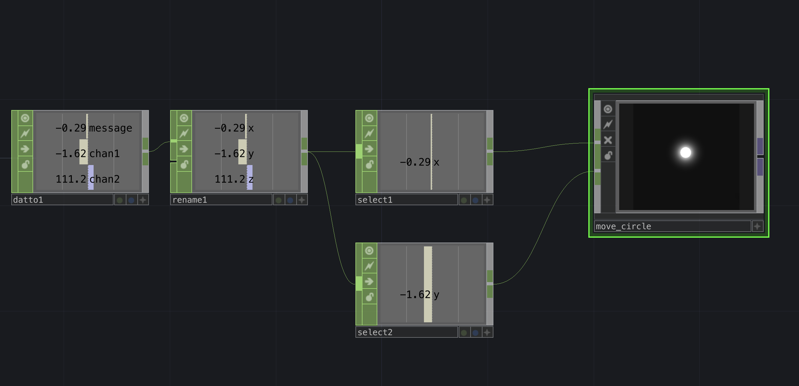

# Parsing Values in Arduino
## Sections

* [Description](#description)
* [Arduino Circuit](#arduino-circuit)
* [Button State Change](#button-state-change)
* [Using the Map Function](#map-function)
* [Constrain](#constrain)
* [Averaging](#averaging)
* [Resources](#resources)
* [Further Resources](#further-resources)

## Description

This page will cover some brief strategies for filtering or transforming data before you send it to TouchDesigner (or any other software). TouchDesigner has its own ways of filtering and transformming data, however there may be times when it is preferable or necessary to filter values from the microcontroller first.  


## Materials and Libraries
We will use the Arduino Nano 33 IoT, a pushbutton, a potentiometer, and a light sensor, however these strategies can be applied to other microcontrollers and other sensors as well.
* [Arduino Nano 33 IoT](https://store-usa.arduino.cc/products/arduino-nano-33-iot) 
* [Arduino IDE](https://www.arduino.cc/en/software)
* Breadboard, USB cable, Jumper wires, Push button, Potentiometer, Light sensor

## Arduino Circuit:


## Button State Change
When reading a button, you may want to write code that does something when the button is pressed.  If you use the code below the button will ```Serial.println()``` multiple times because it is being called in the ```loop()``` which will repeat the ```Serial.println()``` function as long as the button press is detected, even a quick press will trigger multiple ```Serial.println()``` calls.


    int currentButtonState;

    void setup() {
        Serial.begin(9600);
        pinMode(2, INPUT_PULLUP);
    }

    void loop() {
        // read the button's current state
        currentButtonState = digitalRead(2);
        // if its currently zero, its being pressed
        if (currentButtonState == 0) {
            Serial.println("Pressed");
        }
        // if its currently one, its not being pressed
        if (currentButtonState == 1) {
            Serial.println("Released");
        }

    }

There will be times when you will want the button press to trigger an action only one time per press and re-trigger only after you release the button and press again.  This is common if you are counting presses or sending any kind of communication (MIDI, API calls, OSC, etc)

Since the Arduino loop runs in real time we must use a variable to store its previous state, and then compare the previous state to the current state.  If they are different, then it means an interaction occurred (either a press or a release).

Step by Step: 

Make global variables for the current and previous states:

    int currentButtonState;
    int prevButtonState;

In ```setup()``` give the ```previousButtonState``` an initial value: 
    
        void setup() {
            prevButtonState = digitalRead(2);
        }

In ```loop()``` read ```currentButtonState``` using ```digitalRead()```

    currentButtonState = digitalRead(2);

Then compare ```previousButtonState``` to ```currentButtonState```. If there is a difference, it means it has changed state.  Update  ```previousButtonState``` to reflect the change that occurred.

    
    if (prevButtonState != currentButtonState) {
         prevButtonState = currentButtonState;
    }

Lastly, once we detect a change, do something when the button is either pressed down or released

    if (prevButtonState != currentButtonState) {
       
        // if its currently zero, its been pressed
        if (currentButtonState == 0) {
            Serial.println("Pressed");
        }

        // if its currently one, its been released
        if (currentButtonState == 1) {
            Serial.println("Released");
        }
       
        // update the previous value to reflect the change
        prevButtonState = currentButtonState;
    }

Full code:

    int currentButtonState;
    int prevButtonState;

    void setup() {
        Serial.begin(9600);
        pinMode(2, INPUT_PULLUP);
        // set an initial reading to compare with current reading
        prevButtonState = digitalRead(2);
    }

    void loop() {
        // read the button's current state
        currentButtonState = digitalRead(2);

        if (prevButtonState != currentButtonState) {
            // if its currently zero, its been pressed
            if (currentButtonState == 0) {
                Serial.println("Pressed");
            }
            // if its currently one, its been released
            if (currentButtonState == 1) {
                Serial.println("Released");
            }
            // update the previous value to reflect the change
            prevButtonState = currentButtonState;
        }
    }


## Map Function
The arduino ```map()``` function takes a variable and converts the value of that variable from one range to another.  For example, the potentiometer's values can range from 0 to 1023.  However if we wanted to use those values to control an LED's brightness, we would need to output a range from 0 to 255 and no bigger.

Create a variable to store the sensor value and use ```analogRead()``` to read and return the sensor value:

    int potentiometer = analogRead(A0);

Note the variable name is potentiometer because I'm using a potentiometer in this example.  And I've written ```analogRead()``` as ```analogRead(A0)``` because the potentiometer is connected to the Arduino's A0 pin.

Next use the ```map()``` function to store a converted value. Define a new variable ```ledValue``` to store the mapped value.  Next assign ```ledValue``` a mapping.  The map function requires 5 arguments.

- 1st: the variable you want to convert ```potentiometer```
- 2nd: the variable's minimum value
- 3rd: the variable's maximum value
- 4th: the new minimum value
- 5th: the new maximum value

I want to map the ```potentiometer```, which has a range between ```0 -  1023```, to output a proportional range between ```0 - 255``` 

    int ledValue = map(potentiometer, 0, 1023, 0, 255);

Full Code:


    void setup() {
        Serial.begin(9600);
    }

    void loop() {
        int potentiometer = analogRead(A0); 
        int ledValue = map(potentiometer, 0, 1023, 0, 255);
    
        Serial.println(ledValue);
    }

Make sure you observe your sensor's actual range and use that as your input values. Double check your desired output range.  For example MIDI values range from 0-127, and TouchDesigner defaults to normalized values 0-1. 


## Constrain

If your sensor is noisy -- values change slightly when you don't interact with the sensor-- or the observed values don't extend to the full 0-1023 range, theres a chance that your sensor may overflow beyond the boundries of you mapped output.  To prevent this overflowing, you can use the ```constrain()``` function to ignore values that are outside of your specified boundries.  

For example if we look at the light sensor, the values do not extend all the way from 0-1023, but because lighting conditions can change, its possible that the values might extend beyond the boundries we set, and if that happens a mapped value would also extend beyond the defined boundries.

The ```constrain()``` function cuts off any numbers that fall outside of the defined boundries. So in the code below, the following line ensures that the ledValue remains between 0 and 255

     int ledValue = constrain(ledValue, 0,255);


Full Code:


    void setup() {
        Serial.begin(9600);
    }

    void loop() {
        int lightSensor = analogRead(A1); 
        int ledValue = map(lightSensor, 200, 900, 0, 255);
        int ledValue = constrain(ledValue, 0,255);
    
        Serial.println(ledValue);
    }


## Averaging

    int potentiometerAverage;
    int avgSamples = 25; // try different numbers

    void setup() {
        Serial.begin(9600);
    }

    void loop() {

        int total = 0;

        for (int i = 0; i < avgSamples; i++) {
            total += analogRead(A0);
        }

        potentiometerAverage = total / avgSamples;

        Serial.println(potentiometerAverage);
    }

## Analog State Change with Noise Reduction

Similar to our [Button State Change](#button-state-change).  There will be times when you want a sensor to trigger something only when the sensor has changed significantly.  D

    int noise = 15;
    int prevPot;

    void setup() {
        Serial.begin(9600);
        prevPot = analogRead(A0);
    }

    void loop() {
        // reset total each loop
        int pot = analogRead(A0);

        if (abs(prevPot - pot) > noise) {
            Serial.println(pot);
            prevPot = pot;
        }
    }


<!-- Use a ```select``` CHOP to split channels into individual CHOPs.  This will make each channel individually routable.

Next connect to one of the premade examples. From here you should be able to see some changes and explore changing values to get different effects.

 -->


## Logic Chop Functions
### Invert
### Toggle
### Radio
### Invert

## Smooth Values using Lag
