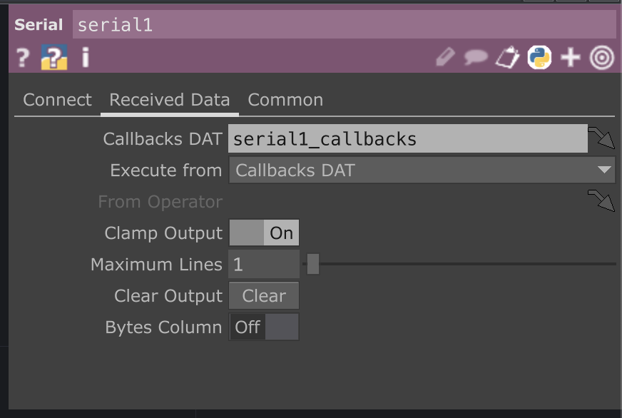

# Serial Communication to TouchDesigner With Arduino IMU

* [Description](#description)
* [Arduino Circuit](#arduino-circuit)
* [Arduino Serial Setup with IMU](#arduino-serial-w-imu)
* [TouchDesigner](#touchdesigner)
* [Selecting and Exporting](#selecting-and-exporting)
* [Resources](#resources)
* [Further Resources](#further-resources)

## Description
In this example we will use the Arduino Nano 33 IoT's as a controller for visuals in TouchDesigner.  We wil use the Arduino's onboard IMU sensor to get rotational data in the x, y, z axis and send that data to TouchDesigner using Serial Communication.  Because the sensor is built into the Nano 33 IoT we will not need any other sensors or peripherals for this example.

## Materials and Libraries
* [Arduino Nano 33 IoT](https://store-usa.arduino.cc/products/arduino-nano-33-iot) (or other Wifi Enabled board, MKR 1010, etc)
* [Arduino IDE](https://www.arduino.cc/en/software)
* [TouchDesigner (free version)](https://derivative.ca/)
* Breadboard, USB cable, Jumper wires

## Arduino Circuit:
This example will use the internal IMU sensor.  You can just plug the microcontroller into the breadboard, no extra circuitry is necessary for this tutorial


## Arduino Serial w/ IMU
Make sure you have installed the LSM6DS3 library and the MadgwickAHRS Library from the Library Manager.  LSM6DS3 library will allow us to access the IMU data and the MadgwickAHRS will help parse the gyroscope readings.


Once the libaries are installed, include them in your sketch:
    
    #include <Arduino_LSM6DS3.h>
    #include <MadgwickAHRS.h>

Add Global variables for the Madgwick Filter and the sensor sample rate. This example will only use the IMU's Gyroscope so create 3 variables to capture rotations on the x,y, and z axes of the Arduino.  I've called these variables twist, tilt, and turn.  If you want to try acceleration as well, create 3 more variables 


      Madgwick filter;
      // sensor's sample rate is fixed at 104 Hz:
      const float sensorRate = 104.00;

      // values for orientation:
      float x = 0.0;
      float y = 0.0;
      float z = 0.0;

In setup, check if the IMU is running.  If it is enabled, then begin filtering the values

      void setup() {
        Serial.begin(9600);
        // attempt to start the IMU:
          if (!IMU.begin()) {
            Serial.println("Failed to initialize IMU");
            // stop here if you can't access the IMU:
            while (true)
              ;
          }
        // start the filter to run at the sample rate:
        filter.begin(sensorRate);
      }
In the loop, check if the IMU is ready to read. If it is, grab the values and use ```Serial.print()``` to send the values to TouchDesigner.

      void loop() {
        // values for acceleration & rotation:
        float xAcc, yAcc, zAcc;
        float xGyro, yGyro, zGyro;

        // check if the IMU is ready to read:
        if (IMU.accelerationAvailable() && IMU.gyroscopeAvailable()) {
          // read accelerometer & gyrometer:
          IMU.readAcceleration(xAcc, yAcc, zAcc);
          IMU.readGyroscope(xGyro, yGyro, zGyro);

          // update the filter, which computes orientation:
          filter.updateIMU(xGyro, yGyro, zGyro, xAcc, yAcc, zAcc);

          // print the heading, pitch and roll
          
          x = filter.getPitch();
          y = filter.getYaw();
          z = filter.getRoll();

          Serial.print(x);   // tilt up / down
          Serial.print(",");    
          Serial.print(y);    // turn left /right
          Serial.print(",");
          Serial.println(z);  // twist / roll
        }
      }

Note the formatting. We will use ```Serial.print()``` and ```Serial.println()``` to send multiple sensor values from the Arduino to Touchdesigner.  The goal is to format everything so that TouchDesigner will interpret the sensor data as one message containing multiple values where the values are separated by commas and terminating with '\r\n' 

Use ```Serial.print()``` to send a value, then use ```Serial.print()``` again to send a _delimiter_. This delimiter should be a non alpha numerical character that will separate each individual value. I'm using commas ( , ) to separate values.  In TouchDesigner I will eventually have to specify that commas are being used as delimiters (to separate my individual values).  Make sure the last value that you send uses the ```Serial.println()``` function.  This is how TouchDesigner will know that you intend to send a message that contains multiple values.
```

      Serial.print(x);   // tilt up / down
      Serial.print(",");    
      Serial.print(y);    // turn left /right
      Serial.print(",");
      Serial.println(z);  // twist / roll
      
```
Confirm that the sensors are working by opening the ```Serial Monitor``` and observing the values.  If the values are relatively consistent when the arduino is resting, and relatively smooth chaning when you move the arduino, then you are ready to move on.


## TouchDesigner
You can download the sample .toe file from this repo and also follow along with the serial set up below

Create a serial DAT, it will be turned off, and look like this until you enable it.


Next go to the parameters and begin entering your info:


My settings look like the image below:
* Row Callback Format: ```One Per Line```
* Port: ```COMx``` on Windows ```/dev/cu.usbmodemxxxx``` on Mac 


If all is set correctly, and arduino is printing information you should see some information in the Serial DAT


You may see multple lines of information.  You can go to the ```Received Data``` tab to change the output.  Change ```Maximum Lines``` to the amount of lines you want to show in your DAT.  1 line is enough for this tutorial.


Once the data is reliably displaying in the ```serial1``` DAT TouchDesigner use the ```convert``` DAT to breakout each value into its own separate column.

The default for ```Split Cells At``` parameter is a tab character: ```\t```


Change this parameter to a comma: ```,``` to see your data separated


Once the data is in separate individualized commas use a ```datTo1``` CHOP to convert incoming data into channel information.  Once it is in channel (CHOP) format, the sensor data can eventually be easily exported to other operators and parameters.

Use the follow settings for the ```datTo1``` CHOP:
* DAT: ```convert1```
* Select Rows: ```by Index```
* Start Row Index: ```1```
* Start Row Index: ```1``` (Should be default)
* Select Cols: ```by Index```
* Start Col Index: ```0```
* End Col Index: ```2``` (use your actual last column from the convert1 DAT)
* Output: ```Channel per Column```
* First Row is : ```Names ``` 
* First Column is : ```Values``` 

 

If everything is formatted correctly the output should look similar to the image below, with each sensor value being shown as a channel in the ```datTo1``` CHOP


## Label your channels 
Channels will be named based on the header row from the ```convert``` DAT. Empty rows will be automatically labeled as `chan` + an index number. In this case we see the second and third channels are labeled `chan1` and `chan2`.

Even though it is not necessary in this case, you may want to use a ```rename``` CHOP to change channel names to match the sensors' axes.  


In the ```From``` field you can use an asterisk ```*``` to select all channels in order.  Use the ```To``` field to define your desired channel names, in this case `x y z`.  When renaming, separate each name with a space. 


## Selecting, Mapping, and Exporting

Once your sensor values are correctly formatted as individual channels in a CHOP you can begin separating, mapping, and parsing those values to control other parameters of your TouchDesigner network such as Audio / Visual effects, UI components, Trigger new behaviors, and much more.

Please see the [parsing page](parsing.md) for a few basic strategies and examples of applying your CHOP data.


## Related Resources
* [ITP Physical Computing Site](https://itp.nyu.edu/physcomp/)
* [ITP Physical Computing IMU Serial Lab](https://itp.nyu.edu/physcomp/labs/lab-serial-imu-output-to-p5-js/)


## Further Resources
* [TouchDesigner Curriculum for Beginners ](https://learn.derivative.ca/)
* [Interactive & Immersive HQ Youtube](https://www.youtube.com/c/TheInteractiveImmersiveHQ)
* [Matthew Ragan's Teaching / Learning Resources](https://matthewragan.com/teaching-resources/touchdesigner/)
* [Elburz Sorkhabi and Matthew Ragan's Interactive & Immersive HQ](https://interactiveimmersive.io/)
* [Bileam Tschepe's youtube](https://www.youtube.com/channel/UCONptu0J1PCrW9YfBtSdqjA)
* [PPPANIK youtube](https://www.youtube.com/channel/UCWBbakpo_cATqJy9Dzf9x4w)
* [Paketa12 youtube](https://www.youtube.com/user/paketa12)
* [alltd.org](https://alltd.org/)
* [Elburz Sorkhabi (Interactive Immersive HQ) Particles and Metaballs](https://www.youtube.com/watch?v=FAYpBUBDonY)
* [Crystal Jow Holiday Point Clouds (Interactive Immersive HQ) ](https://www.youtube.com/watch?v=o0Hli7C1RME)
* [Crystal Jow Generative Warhol Tutorial (Interactive Immersive HQ) ](https://www.youtube.com/watch?v=KmUUHRzG7UE)


[Just the Docs]: https://just-the-docs.github.io/just-the-docs/
[GitHub Pages]: https://docs.github.com/en/pages
[README]: https://github.com/just-the-docs/just-the-docs-template/blob/main/README.md
[Jekyll]: https://jekyllrb.com
[GitHub Pages / Actions workflow]: https://github.blog/changelog/2022-07-27-github-pages-custom-github-actions-workflows-beta/
[use this template]: https://github.com/just-the-docs/just-the-docs-template/generate
