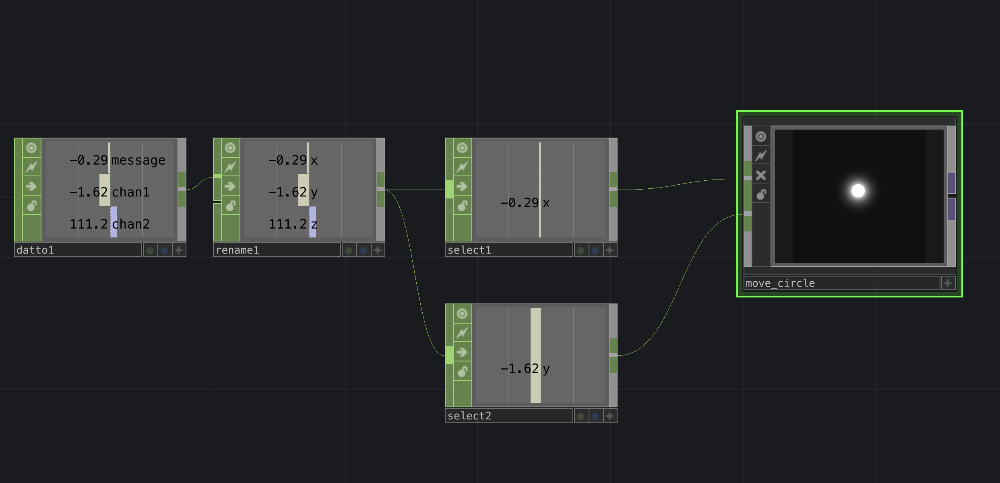

# Parsing Values in TD

This page will cover some brief strategies for parsing data once TouchDesigner has already connected via Serial.


## Selecting, Mapping, and Exporting

<!-- Use a ```select``` CHOP to split channels into individual CHOPs.  This will make each channel individually routable.

Next connect to one of the premade examples. From here you should be able to see some changes and explore changing values to get different effects.

 -->


## Logic Chop Functions
### Invert
### Toggle / Momentary
### Radio
### Counter

## Smooth Values using Lag